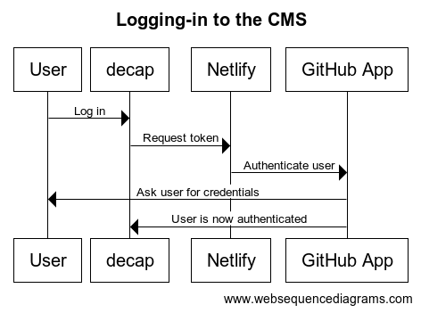

# Authentication

## CMS (decap)

Read more about how [decap uses GitHub for authentication](https://decapcms.org/docs/github-backend/).

To access the CMS content editor (decap), users must have a GitHub account with write access
to the CMS repository associated with the given environment.

For authentication, decap requires a back-end which GitHub does not provide. Therefore, it uses
[Netlify](https://app.netlify.com/) for that purpose. Netlify uses the GitHub App
[decap-cms](https://github.com/apps/decap-cms).

Netlify's configuration consists of two crucial parts:

1. GitHub App's Client ID and Secret [here](https://app.netlify.com/projects/opendata-swiss-cms/configuration/security#oauth)
2. [Whitelist of app domains](https://app.netlify.com/projects/opendata-swiss-cms/domain-management#production-domains) that are allowed to access the GitHub App.

<!--
title Logging-in to the CMS

User->decap: Log in
decap->Netlify: Request token
Netlify->GitHub App: Authenticate user
GitHub App->User: Ask user for credentials
GitHub App->decap: User is now authenticated
-->

Once logged in, decap communicates with GitHub directly to create and update Pull Requests
in the CMS repository on behalf of the user.

## App

The process of submitting a showcase creates a Pull Request in the CMS repository,
thus requiring write access to it. Similarly to decap, a GitHub 
App [opendata-swiss-cms](https://github.com/apps/opendata-swiss-cms) is used for authentication.
The difference is that decap uses a GitHub App to authenticate users, while the app uses
a GitHub App to authenticate itself. 
